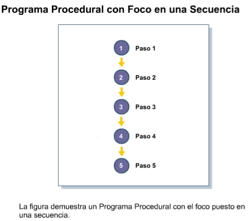
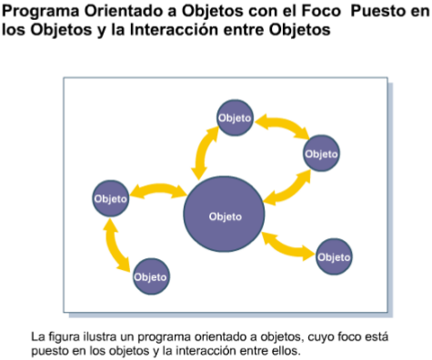
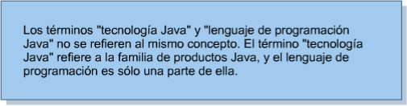

Fundamentos de Java
===========================

1 Explicando la Tecnología Java
+++++++++++++++++++++++++++++++++

Este módulo es la introducción al lenguaje Java. A lo largo del mismo describiremos los conceptos fundamentales del lenguaje de programación Java, aprenderemos de los tres grupos de productos de la tecnología Java y resumiremos sus etapas de ciclo de vida.

1.1 Objetivos
+++++++++++++

Una vez finalizado este módulo, usted será capaz de:
* Describir los conceptos fundamentales del lenguaje de programación Java
* Listar los tres grupos de productos de la tecnología Java
* Resumir cada una de las siete etapas del ciclo de vida de un producto.

Este módulo ofrece una visión general de la tecnología Java, de la programación basada
en la tecnología Java y del ciclo de vida del desarrollo de una aplicación.

1.3 Relevancia
++++++++++++++++++

Discusión – Las siguientes preguntas son relevantes para comprender de qué se trata la
tecnología Java:

¿Cuál es su definición para las siguientes palabras?

Seguridad
Orientación a Objetos
Independencia
Dependencia
Distribución

¿Cuáles son las etapas comprendidas en la construcción de alguna cosa, como por
ejemplo una casa o un mueble?

1.5 Conceptos Fundamentales del Lenguaje de Programación Java
++++++++++++++++++++++++++++++++++++++++++++++++++++++++++++++++++

El lenguaje de programación Java se originó en 1991 como parte de un proyecto de investigación para desarrollar un lenguaje de programación, llamado "Oak", que permitiera hacer un puente para disminuir la brecha de comunicación entre varios tipos de dispositivos electrónicos, como por ejemplo reproductores de video casettes (VCR) y televisores. Específicamente, un equipo de desarrolladores de software altamente calificado (denominado el equipo Verde) quería crear un lenguaje de programación que permitiera  a los dispositivos electrónicos con distintas unidades centrales de proceso (CPU) compartir los mismos beneficios del software.

El concepto inicial falló después de varios intentos con las compañías fabricantes de dispositivos electrónicos. El equipo Verde fue entonces orientado a buscar otro mercado para el nuevo lenguaje de programación. Afortunadamente, comenzó la popularidad delWorld Wide Web y el equipo reconoció que el lenguaje Oak era perfecto para desarrollar componentes multimedia para mejorar las páginas Web. Estas pequeñas aplicaciones, denominadas applets, constituyeron el primer uso del lenguaje Oak y los programadores usuarios de Internet adoptaron lo que se constituiría en el lenguaje de programación Java.

El lenguaje de programación Java fue diseñado para ser:

* Orientado a objetos.
* Distribuido.
* Simple.
* Multihilo.
* Seguro.
* Independiente de la plataforma.

1.5.1 Orientado a Objetos
+++++++++++++++++++++++++++

El lenguaje de programación Java es un lenguaje de programación orientado a objetos (POO) porque uno de los principales objetivos del programador en tecnologías Java es crear objetos, fragmentos de código autónomo, que puedan interactuar con otros objetos para resolver un problema. La POO comenzó con el lenguaje de programación SIMULA­67 en 1967 y condujo a la creación de otros lenguajes de programación populares, como C++, en el que el lenguaje de programación Java está basado. 

La POO difiere de la programación procedural en que esta última hace hincapié en la secuencia de los pasos requeridos para resolver un problema, mientras que la POO hace hincapié en la creación y la interacción de los objetos. 

1.5.2 Distribuido
++++++++++++++++++

El lenguaje de programación Java es un lenguaje distribuido porque ofrece soporte para tecnologías de redes distribuidas, tales como Remote Method Invocation (RMI),Common Object Request Broker Architecture (CORBA), y Universal Resource Locator (URL). Adicionalmente, la capacidad de carga dinámica de clases de la tecnología Java permite que fragmentos de código sean descargados a través Internet y ejecutados sobre un computador personal.

.. figure:: ../images/Fundamentos_Java/04.png

1.5.3 Simple
++++++++++++++++

El lenguaje de programación Java es simple debido a que sus diseñadores quitaron algunas de las construcciones complejas y poco claras que se encuentran en otros lenguajes de programación populares. Por ejemplo, el lenguaje de programación Java no permite que los programadores puedan manipular directamente punteros a ubicaciones de memoria, lo que constituye una característica compleja de los lenguajes de programación C y C++, que frecuentemente es mal usada. En cambio, el lenguaje de programación Java sólo permite a los programadores manipular objetos usando referencias a objetos. El lenguaje de programación utiliza también una característica denominada "garbage collector" para controlar y eliminar aquellos objetos que ya no están referenciados.Otra característica que hace simple al lenguaje de programación Java es que un tipo de datos boolean puede tener un valor true (verdadero) o false (falso), a diferencia de otros lenguajes de programación donde el valor también puede ser 1 o 0. 

