Fundamentos de Java
===========================

1 Explicando la Tecnología Java
+++++++++++++++++++++++++++++++++

Este módulo es la introducción al lenguaje Java. A lo largo del mismo describiremos los conceptos fundamentales del lenguaje de programación Java, aprenderemos de los tres grupos de productos de la tecnología Java y resumiremos sus etapas de ciclo de vida.

1.1 Objetivos
+++++++++++++

Una vez finalizado este módulo, usted será capaz de:
* Describir los conceptos fundamentales del lenguaje de programación Java
* Listar los tres grupos de productos de la tecnología Java
* Resumir cada una de las siete etapas del ciclo de vida de un producto.

Este módulo ofrece una visión general de la tecnología Java, de la programación basada
en la tecnología Java y del ciclo de vida del desarrollo de una aplicación.

1.3 Relevancia
++++++++++++++++++

Discusión – Las siguientes preguntas son relevantes para comprender de qué se trata la
tecnología Java:

¿Cuál es su definición para las siguientes palabras?

Seguridad
Orientación a Objetos
Independencia
Dependencia
Distribución

¿Cuáles son las etapas comprendidas en la construcción de alguna cosa, como por
ejemplo una casa o un mueble?

1.5 Conceptos Fundamentales del Lenguaje de Programación Java
++++++++++++++++++++++++++++++++++++++++++++++++++++++++++++++++++

El lenguaje de programación Java se originó en 1991 como parte de un proyecto de investigación para desarrollar un lenguaje de programación, llamado "Oak", que permitiera hacer un puente para disminuir la brecha de comunicación entre varios tipos de dispositivos electrónicos, como por ejemplo reproductores de video casettes (VCR) y televisores. Específicamente, un equipo de desarrolladores de software altamente calificado (denominado el equipo Verde) quería crear un lenguaje de programación que permitiera  a los dispositivos electrónicos con distintas unidades centrales de proceso (CPU) compartir los mismos beneficios del software.

El concepto inicial falló después de varios intentos con las compañías fabricantes de dispositivos electrónicos. El equipo Verde fue entonces orientado a buscar otro mercado para el nuevo lenguaje de programación. Afortunadamente, comenzó la popularidad delWorld Wide Web y el equipo reconoció que el lenguaje Oak era perfecto para desarrollar componentes multimedia para mejorar las páginas Web. Estas pequeñas aplicaciones, denominadas applets, constituyeron el primer uso del lenguaje Oak y los programadores usuarios de Internet adoptaron lo que se constituiría en el lenguaje de programación Java.

El lenguaje de programación Java fue diseñado para ser:

* Orientado a objetos.
* Distribuido.
* Simple.
* Multihilo.
* Seguro.
* Independiente de la plataforma.

1.5.1 Orientado a Objetos
+++++++++++++++++++++++++++

El lenguaje de programación Java es un lenguaje de programación orientado a objetos (POO) porque uno de los principales objetivos del programador en tecnologías Java es crear objetos, fragmentos de código autónomo, que puedan interactuar con otros objetos para resolver un problema. La POO comenzó con el lenguaje de programación SIMULA­67 en 1967 y condujo a la creación de otros lenguajes de programación populares, como C++, en el que el lenguaje de programación Java está basado. 

La POO difiere de la programación procedural en que esta última hace hincapié en la secuencia de los pasos requeridos para resolver un problema, mientras que la POO hace hincapié en la creación y la interacción de los objetos. 

1.5.2 Distribuido
++++++++++++++++++

El lenguaje de programación Java es un lenguaje distribuido porque ofrece soporte para tecnologías de redes distribuidas, tales como Remote Method Invocation (RMI),Common Object Request Broker Architecture (CORBA), y Universal Resource Locator (URL). Adicionalmente, la capacidad de carga dinámica de clases de la tecnología Java permite que fragmentos de código sean descargados a través Internet y ejecutados sobre un computador personal.

.. figure:: ../images/Fundamentos_Java/03.png

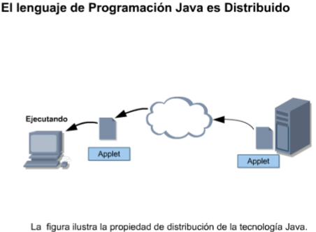

1.5.3 Simple
++++++++++++++++

El lenguaje de programación Java es simple debido a que sus diseñadores quitaron algunas de las construcciones complejas y poco claras que se encuentran en otros lenguajes de programación populares. Por ejemplo, el lenguaje de programación Java no permite que los programadores puedan manipular directamente punteros a ubicaciones de memoria, lo que constituye una característica compleja de los lenguajes de programación C y C++, que frecuentemente es mal usada. En cambio, el lenguaje de programación Java sólo permite a los programadores manipular objetos usando referencias a objetos. El lenguaje de programación utiliza también una característica denominada "garbage collector" para controlar y eliminar aquellos objetos que ya no están referenciados.Otra característica que hace simple al lenguaje de programación Java es que un tipo de datos boolean puede tener un valor true (verdadero) o false (falso), a diferencia de otros lenguajes de programación donde el valor también puede ser 1 o 0. 

1.5.4 Multihilo
++++++++++++++++

El lenguaje de programación Java ofrece facilidades de multihilo, esto es, realizar varias tareas al mismo tiempo, tales como consultar una base de datos y desplegar una interfaz de usuario. La tecnología multihilo posibilita que un programa basado en la tecnología Java sea muy eficiente en el uso que hace de los recursos del sistema. 

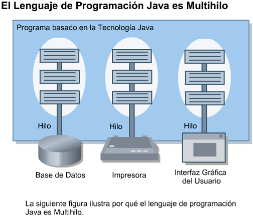

1.5.5 Seguro
++++++++++++++++

Los programas basados en la tecnología Java son seguros debido a que el lenguaje de programación Java, junto al entorno en el cual estos programas ejecutan, utilizan medidas de seguridad para proteger los programas de ataques externos. Estas medidas incluyen:
* Prohibir el manejo de la memoria usando punteros
* Prohibir a los programas distribuidos, tales como los applets, leer y escribir a un disco duro de un computador.
* Verificar que todos los programas basados en la tecnología Java contienen código válido.Soportar firmas digitales. 
* El código basado en la tecnología Java puede ser "firmado" por una compañía o por una persona de forma tal que otra persona que reciba el código pueda verificar la legitimidad del mismo.

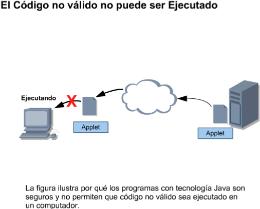

1.5.6 Independiente de la Plataforma
+++++++++++++++++++++++++++++++++++++++ 

Los programas escritos en otros lenguajes requieren generalmente numerosas modificaciones para poder ejecutarse sobre más de un tipo de plataforma (computacional). Se entiende por plataforma computacional una combinación de una CPU y un sistema operativo. Esta dependencia de la plataforma se debe a que muchos lenguajes requieren que se escriba código específico para la plataforma subyacente. Los lenguajes de programación populares como C y C++ requieren que el programador compile y ensamble sus programas, obteniendo como resultado un programa ejecutable único para una determinada plataforma. A diferencia de C y C++, el lenguaje de programación Java es independiente de la plataforma.

Programas dependientes de la plataforma:
Un compilador es una aplicación que convierte un programa escrito por un programador, en un código específico para una CPU. A este código se le denomina código de máquina. Estos archivos específicos para cada plataforma (archivos binarios) se combinan frecuentemente con otros archivos, tales como bibliotecas que contienen código previamente escrito, usando un ensamblador para crear un programa dependiente de la plataforma (al que se le denomina ejecutable), y que puede ser ejecutado por un usuario final.

Programas independientes de la plataforma:
Un programa basado en la tecnología Java puede ejecutar sobre varias combinaciones de CPUs y sistemas operativos diferentes, tales como:
* Solaris OS sobre un chip SPARC®, MacOS sobre un chip Motorola y Microsoft
* Windows sobre un chip Intel, generalmente con muy pocas o sin modificaciones

Al igual que los programas C y C++, los programas basados en la tecnología Java también son compilados usando un compilador de la tecnología Java. Sin embargo, el formato resultante de un programa basado en la tecnología Java compilado es bytecode de la tecnología Java independiente de la plataforma, en lugar de código de máquina específico para una CPU. Luego que el bytecode es creado, es interpretado (ejecutado) por un intérprete de bytecode denominado la máquina virtual (o MV). 

Una máquina virtual es un programa para una plataforma específica que entiende bytecode independiente de la plataforma y que puede ejecutarlo sobre una plataforma particular.

Por esta razón, el lenguaje de programación Java es frecuentemente referido como un lenguaje interpretado y los programas con  tecnología Java son denominados portables o ejecutables sobre cualquier plataforma. Existen varios lenguajes interpretados, como por ejemplo Perl. 

Para que los programas con tecnología Java sean independientes de la plataforma, se requiere una máquina virtual, denominada la "Máquina Virtual Java", sobre cada plataforma donde los programas serán ejecutados. La Máquina Virtual Java es responsable de:
interpretar el código basado en la tecnología Java, cargar las clases Java y ejecutar los programas basados en la tecnología Java.

Sin embargo, un programa basado de la tecnología Java necesita más que una Máquina Virtual Java para poder ejecutar. Un programa basado en la tecnología Java necesita también un conjunto de bibliotecas de clases Java estándar para la plataforma. Las bibliotecas de clases Java son bibliotecas de código previamente escrito que pueden ser  combinadas con el código que usted escriba para crear aplicaciones robustas.

Conjuntamente, el software de la JVM y las bibliotecas de clase Java, son denominados el entorno de ejecución de Java (Java runtime environment JRE). Los entornos de ejecución de Java están disponibles en Sun Microsystems para muchas de las plataformas más comunes.

La capacidad de los programas basados en la tecnología Java para ejecutar sobre todas las plataformas es central en el lema de Sun Microsystems "Escribir una vez, ejecutar en cualquier lugarTM" ("Write Once, Run AnywhereTM"). 

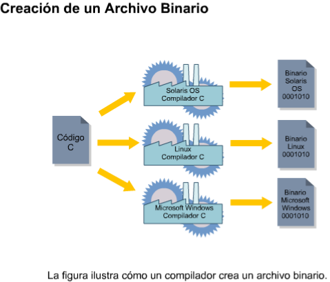

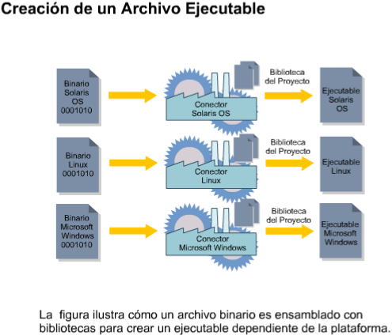

.. figure:: ../images/Fundamentos_Java/09.png

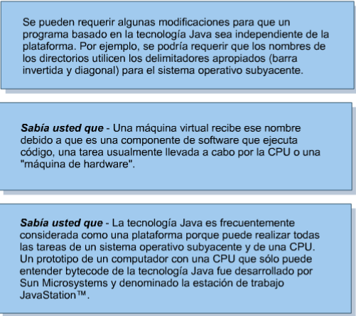

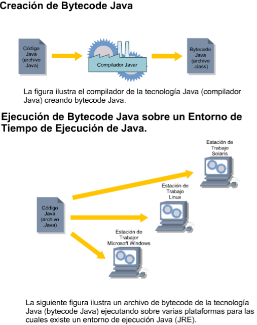

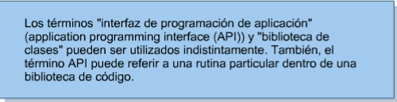

1.6 Grupos de Productos de la Tecnología Java
++++++++++++++++++++++++++++++++++++++++++++++++

Sun Microsystems provee una línea completa de productos de tecnología Java que van desde kits que crean programas basados en la tecnología Java hasta entornos para emular dispositivos electrónicos y móviles (por ejemplo, teléfonos móviles). 

1.6.1 Identificación de los Grupos de Productos de la Tecnología Java
++++++++++++++++++++++++++++++++++++++++++++++++++++++++++++++++++++++++++

Las tecnologías Java, tales como la Máquina Virtual Java, están incluidas (en diferentes formas) en tres grupos de productos, cada uno de los cuales fue diseñado para satisfacer las necesidades de un mercado objetivo paricular:
* JavaTM 2 Platform, Standard Edition (J2SETM) ­ Permite el desarrollo de applets y aplicaciones que ejecutan en el navegador Web y sobre el escritorio del computador, respectivamente. Por ejemplo, usted puede utilizar el J2SE Software Developers Kit (SDK) para crear un programa procesador de palabras para un computador personal. 
* JavaTM 2 Platform, Enterprise Edition (J2EETM) ­ Permite crear grandes aplicaciones empresariales distribuidas cliente­servidor. Por ejemplo, se puede utilizar el J2EE SDK para crear una aplicación correspondiente al sitio web de una compañía de ventas al por menor, implementando sobre él una tienda virtual (eCommerce o Comercio Electrónico)
* JavaTM 2 Platform, Micro Edition (J2METM) ­ Permite crear aplicaciones para dispositivos electrónicos con recursos restringidos. Por ejemplo, usted puede utilizar J2ME SDK para crear un juego que ejecute en un teléfono móvil.

Entre otras tecnologías Java, cada edición incluye un kit de desarrollo de software (SDK) que permite a los programadores crear, compilar y ejecutar sus programas basados en la tecnología Java sobre una plataforma particular.

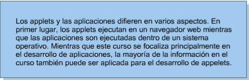

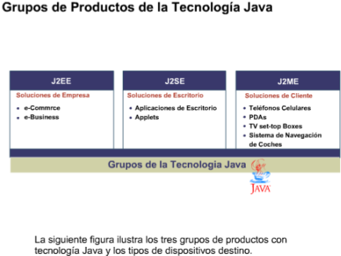

1.6.2 Selección del Grupo de Productos de la Tecnología Java Correctos
++++++++++++++++++++++++++++++++++++++++++++++++++++++++++++++++++++++

Mientras que muchos programadores Java se especializan en el desarrollo de aplicaciones para un mercado objetivo particular, los programadores generalmente comienzan sus carreras creando aplicaciones y applets para computadores personales.
Por lo tanto, el kit J2SE SDK es el grupo de productos más usado por los programadores mientras aprenden el lenguaje de programación JavaTM. 

1.6.3 Uso de los componentes del SDK de la Plataforma Java 2, Standard Edition
+++++++++++++++++++++++++++++++++++++++++++++++++++++++++++++++++++++++++++++++++++++

Sun Microsystems ha desarrollado una versión del SDK para la Plataforma Java 2, Standard Edition para:
* el sistema operativo Solaris OS sobre el chip SPARC (32 bits),
* el sistema operativo Microsoft Windows sobre el chip Intel (32 bits),
* el sistema operativo Linux sobre el chip Intel y
* el sistema operativo Solaris OS sobre el chip SPARC (64©\bits).

El SDK para la Plataforma Java 2, Standard Edition incluye:
El entorno de ejecución de Java:
Una Máquina Virtual Java para la plataforma que usted seleccione.
Las bibliotecas de clases Java para la plataforma que usted seleccione.
Un compilador Java
Documentación de la biblioteca de clases Java (API) (como un archivo para ser
descargado en forma independiente).
Utilidades adicionales, tales como programas para crear archivos JAR (Java archive) y
para depurar programas basados en la tecnología Java.
Ejemplos de programas basados en la tecnología Java.Demostración ­ Su profesor realizará demostraciones de cuatro tipos de aplicaciones
basadas en la tecnología Java. Estas aplicaciones son:
Una aplicación con tecnología J2SE SDK
Un applet con tecnología J2SE SDK
Una aplicación con tecnología J2EE SDK
Una aplicación con tencología J2ME SDK
Durante la demostración, usted debería poner especial atención a:
Cómo se ejecutan el applet y la aplicación (si la ejecución se realiza a través del ingreso
de comandos, haciendo clic sobre un ícono, etc.)
Desde dónde se ejecutan el applet o la aplicación (si es dentro de un navegador Web, un
dispositivo de consumidor, etc.)

1.7 Etapas del Ciclo de vida de un Producto
++++++++++++++++++++++++++++++++++++++++++++++++++++

El ciclo de vida de un producto (CVP) representa un conjunto de etapas aceptado por la industria, que usted debería seguir cuando desarrolle un nuevo producto. Hay siete etapas en el CVP. Estas etapas son:
* Análisis
* Diseño
* Desarrollo
* Prueba
* Implementación
* Mantenimiento
* Fin de Vida

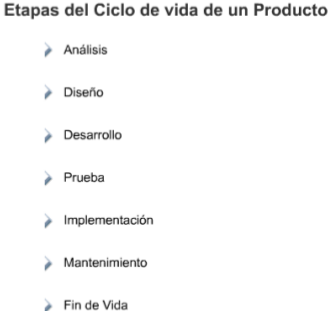

1.7.1 Etapa de Análisis
+++++++++++++++++++++++++++

El análisis es el proceso de investigación de un problema que se quiere resolver con un producto. Entre otras tareas, el análisis consiste en:
* Definir claramente el problema que se quiere resolver, el nicho de Mercado al que está dirigido el producto o el sistema que desea crear. El límite de un problema es también conocido como el alcance del proyecto.
* Identificar los sub­componentes claves que componen el producto total.

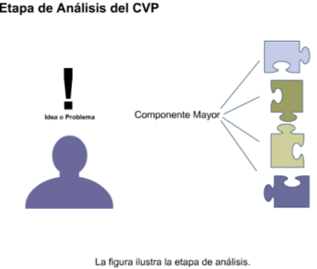

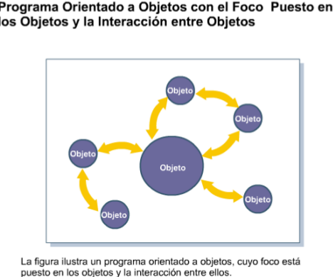

1.7.2 Etapa de Diseño
++++++++++++++++++++++++

El diseño es el proceso que consiste en aplicar los resultados obtenidos durante la etapa de análisis. La primera tarea durante la etapa de diseño consiste en desarrollar blueprints o especificaciones para los productos y componentes del sistema.

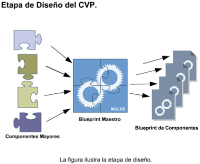

1.7.3 Etapa de Desarrollo
++++++++++++++++++++++++++++

El Desarrollo consiste en la creación de los componentes propiamente dichos, a partir de las maquetas o blueprints creados durante la etapa de diseño.

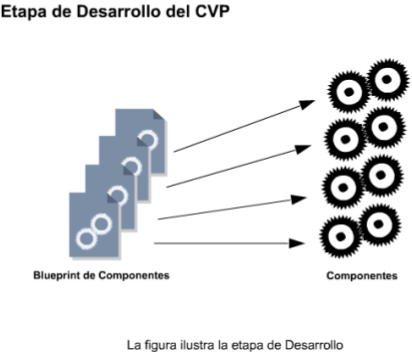

1.7.4 Etapa de Prueba
+++++++++++++++++++++++

La Prueba consiste en el aseguramiento de que los componentes individuales, o el producto en su totalidad, satisfacen los requerimientos de la especificación creada durante la etapa de diseño. La Prueba es realizada generalmente por un equipo integrado por personas que no intervinieron en el desarrollo del producto. Este equipo asegura que el producto está probado, sin ninguna intromisión por parte del desarrollador. 

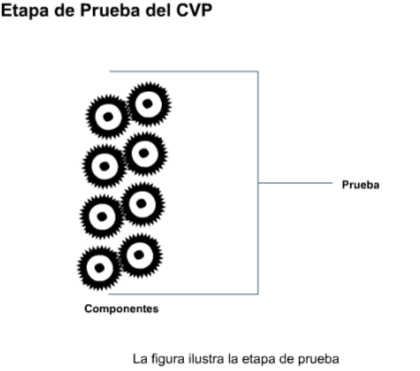

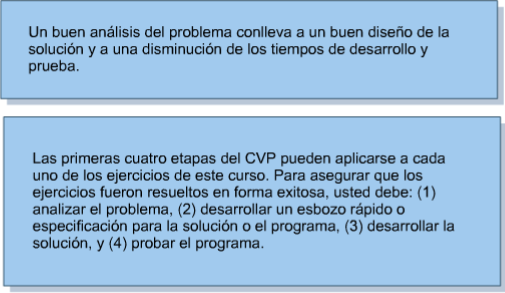

1.7.5 Etapa de Implementación
+++++++++++++++++++++++++++++++

La Implementación consiste en hacer que el producto quede disponible al cliente.

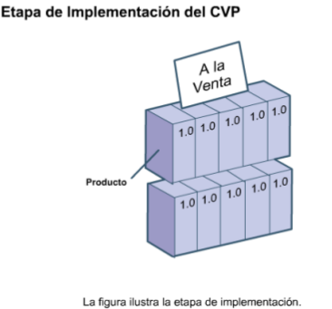

1.7.7 Etapa Fin de Vida
+++++++++++++++++++++++++++

Mientras que el CVP no tiene una etapa separada para el comienzo de un concepto o proyecto, tiene una etapa para el fin del proyecto. Esta etapa de fin de vida consiste en realizar todas las tareas necesarias para asegurar que los clientes y empleados están concientes de que el producto ya no será vendido, que ya no se ofrecerán servicios a los clientes y que está disponible un nuevo producto. 

.. figure:: ../images/Fundamentos_Java/23.png

1.7.8 Por qué se debería seguir el CVP
+++++++++++++++++++++++++++++++++++++++

El CVP es una parte importante del desarrollo de un producto dado que ayuda a asegurar que los productos serán creados y entregados de forma tal que:
* el tiempo de salida al mercado sea reducido,
* el producto tenga alta calidad, y
* el retorno de la inversión sea maximizado
* Los desarrolladores que no siguen el CVP frecuentemente encuentran problemas con sus productos, ya que suelen ser costosos de reparar y hubiesen podido ser evitados.

