Tomcat Hello World Servlet usando Eclipse IDE
================================================

Como crear una class Servlet que imprima por el navegador "Hello World". Vamos a utilizar el EDE Eclipse jee y con Tomcat como servidor de aplicaciones.

* Eclipse Java EE IDE for Web Developers. - Version: 2018-09 (4.9.0) - Build id: 20180917-1800
* Apache Tomcat 9.0.12

Lo primero que se debe hacer es:
* Crear la estructura de directorios (Proyecto)
* Luego crear el aplicativo (Servlet, Web service, etc)
* Crear la configuración para compilar y que genere el empaquetado (EAR, WAR, JAR)
* Desplegar

1. Crear Dynamic Web Project
++++++++++++++++++++++++++++++

Seleccionar desde el menu File --> New --> Dynamic Web Project

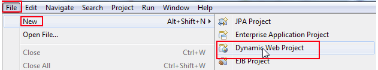

Colocar cualquier nombre al Proyecto, recomendable que tenga asociación con el desarrollo.

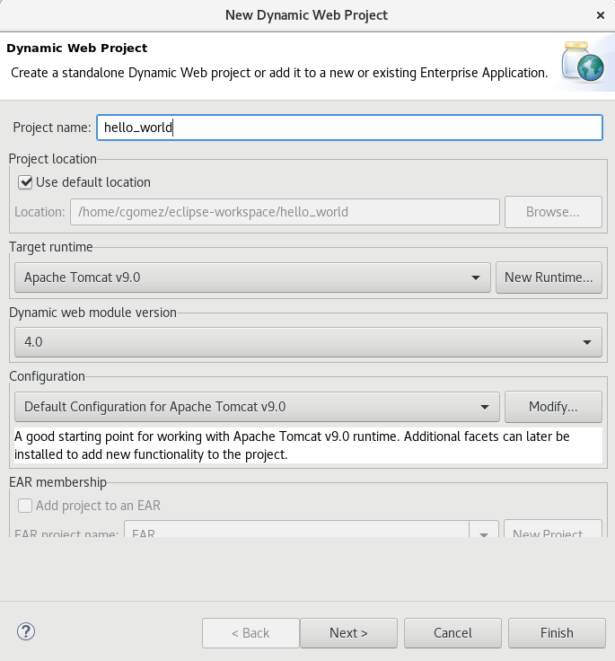

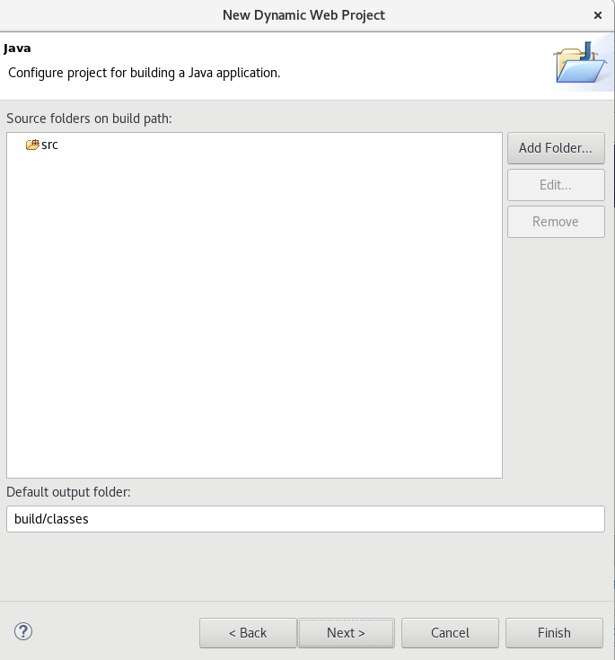

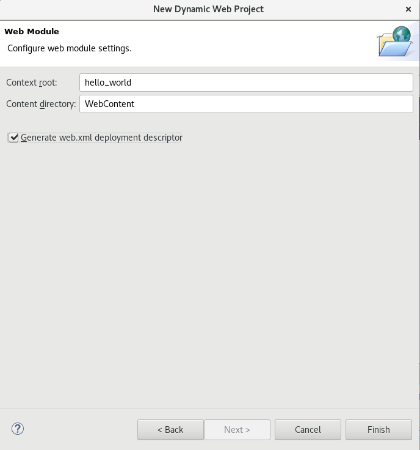

2. Crear un Servlet Class
++++++++++++++++++++++++++++

Seleccionar del menu File --> New --> Servlet.

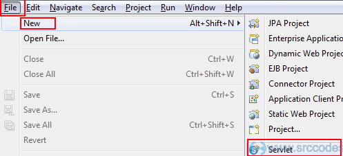

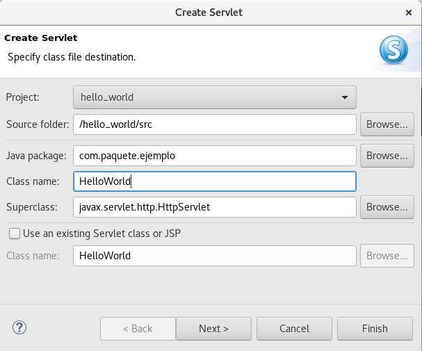

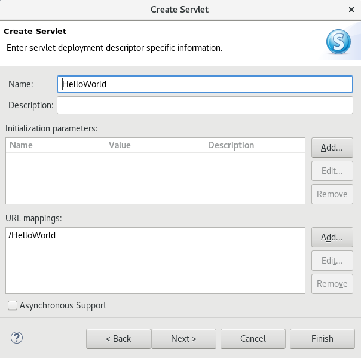

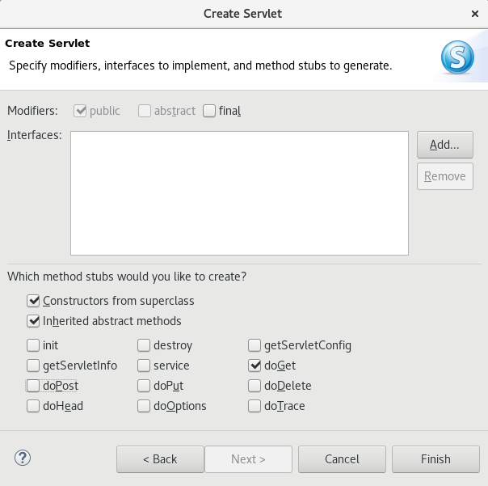

Editamos el HelloWorld.java en el doGet para agregar estas lineas::

	response.setContentType("text/html");
	PrintWriter printWriter  = response.getWriter();
	printWriter.println("<h1>Hello World!</h1>");

El archivo quedaría así::

	package com.paquete.ejemplo;

	import java.io.IOException;
	import java.io.PrintWriter;

	import javax.servlet.ServletException;
	import javax.servlet.annotation.WebServlet;
	import javax.servlet.http.HttpServlet;
	import javax.servlet.http.HttpServletRequest;
	import javax.servlet.http.HttpServletResponse;

	/**
	 * Servlet implementation class HelloWorld
	 */
	@WebServlet("/HelloWorld")
	public class HelloWorld extends HttpServlet {
		private static final long serialVersionUID = 1L;
	       
	    /**
	     * @see HttpServlet#HttpServlet()
	     */
	    public HelloWorld() {
		super();
		// TODO Auto-generated constructor stub
	    }

		/**
		 * @see HttpServlet#doGet(HttpServletRequest request, HttpServletResponse response)
		 */
		protected void doGet(HttpServletRequest request, HttpServletResponse response) throws ServletException, IOException {
			// TODO Auto-generated method stub
			//response.getWriter().append("Served at: ").append(request.getContextPath());
		response.setContentType("text/html");
		PrintWriter printWriter  = response.getWriter();
		printWriter.println("<h1>Hello World!</h1>");
		}

	}

5. Ejecutar Your Servlet Code
+++++++++++++++++++++++++++++++

Click derecho en el proyecto'HelloWorldServlet' y seleccionar menu 'Run As' --> 'Run on Server'.

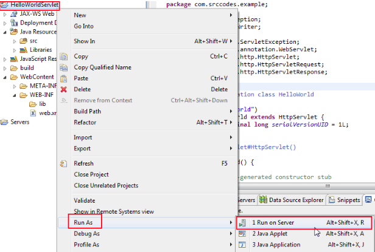

.. figure:: ../images/tomcatServletEclipse/10.png

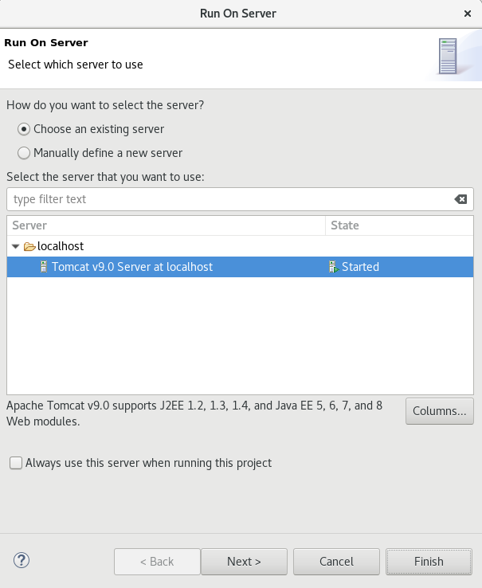

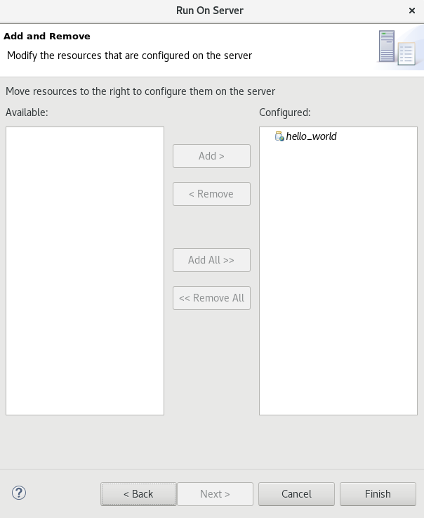

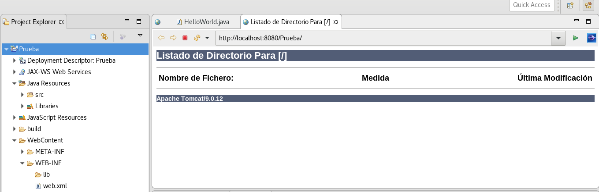

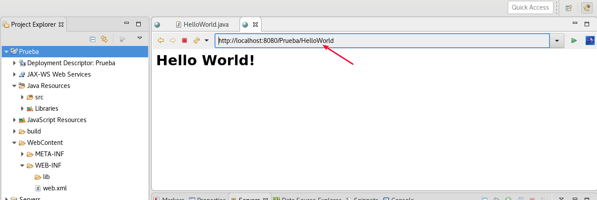

