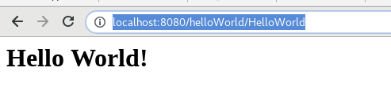

Tomcat Hello World Servlet usando Eclipse IDE
================================================

Como crear una class Servlet que imprima por el navegador "Hello World". Vamos a utilizar el EDE Eclipse jee y con Tomcat como servidor de aplicaciones.

* Eclipse Java EE IDE for Web Developers. - Version: 2018-09 (4.9.0) - Build id: 20180917-1800
* Apache Tomcat 9.0.12

Lo primero que se debe hacer es:
* Crear la estructura de directorios (Proyecto)
* Luego crear el aplicativo (Servlet, Web service, etc)
* Crear la configuración para compilar y que genere el empaquetado (EAR, WAR, JAR)
* Desplegar

1. Crear Dynamic Web Project
++++++++++++++++++++++++++++++

Seleccionar desde el menu File --> New --> Dynamic Web Project

.. figure:: ../images/tomcatServletEclipse/01.png

Colocar cualquier nombre al Proyecto, recomendable que tenga asociación con el desarrollo.

.. figure:: ../images/tomcatServletEclipse/02.png

.. figure:: ../images/tomcatServletEclipse/03.png

.. figure:: ../images/tomcatServletEclipse/04.png

2. Crear un Servlet Class
++++++++++++++++++++++++++++

Seleccionar del menu File --> New --> Servlet.

.. figure:: ../images/tomcatServletEclipse/05.png

.. figure:: ../images/tomcatServletEclipse/06.png

.. figure:: ../images/tomcatServletEclipse/07.png

.. figure:: ../images/tomcatServletEclipse/08.png

Editamos el HelloWorld.java en el doGet para agregar estas lineas::

	response.setContentType("text/html");
	PrintWriter printWriter  = response.getWriter();
	printWriter.println("<h1>Hello World!</h1>");

El archivo quedaría así::

	package com.paquete.ejemplo;

	import java.io.IOException;
	import java.io.PrintWriter;

	import javax.servlet.ServletException;
	import javax.servlet.annotation.WebServlet;
	import javax.servlet.http.HttpServlet;
	import javax.servlet.http.HttpServletRequest;
	import javax.servlet.http.HttpServletResponse;

	/**
	 * Servlet implementation class HelloWorld
	 */
	@WebServlet("/HelloWorld")
	public class HelloWorld extends HttpServlet {
		private static final long serialVersionUID = 1L;
	       
	    /**
	     * @see HttpServlet#HttpServlet()
	     */
	    public HelloWorld() {
		super();
		// TODO Auto-generated constructor stub
	    }

		/**
		 * @see HttpServlet#doGet(HttpServletRequest request, HttpServletResponse response)
		 */
		protected void doGet(HttpServletRequest request, HttpServletResponse response) throws ServletException, IOException {
			// TODO Auto-generated method stub
			//response.getWriter().append("Served at: ").append(request.getContextPath());
		response.setContentType("text/html");
		PrintWriter printWriter  = response.getWriter();
		printWriter.println("<h1>Hello World!</h1>");
		}

	}

5. Ejecutar el código de Servlet
+++++++++++++++++++++++++++++++

Click derecho en el proyecto'HelloWorldServlet' y seleccionar menu 'Run As' --> 'Run on Server'.

.. figure:: ../images/tomcatServletEclipse/09.png

.. figure:: ../images/tomcatServletEclipse/10.png

.. figure:: ../images/tomcatServletEclipse/11.png

.. figure:: ../images/tomcatServletEclipse/12.png

.. figure:: ../images/tomcatServletEclipse/13.png

.. figure:: ../images/tomcatServletEclipse/14.png

6. Crear una WAR y desplegarlo en Tomcat
+++++++++++++++++++++++++++++++++++++++++++

Dentro del projecto creamos el archivo "build.xml" que lo utilizara el ant, con este contenido:

	<?xml version="1.0" encoding="UTF-8" standalone="no"?>
	<project name="Prueba"  basedir=".">
	<!-- Define the properties used by the build -->
	<property name="app.name" value="helloWorld"/>
	<property name="tcserver.home" value="/opt/apache-tomcat-9.0.12" />
	<property name="work.home" value="${basedir}/work"/>
	<property name="dist.home" value="${basedir}/dist"/>
	<property name="src.home" value="${basedir}/src"/>
	<property name="web.home" value="${basedir}/WebContent"/>
	 <target name="help">
	<echo>You can use the following targets:</echo>
	<echo> </echo>
	<echo> help : (default) Prints this message </echo>
	<echo> all : Cleans, compiles, and packages application</echo>
	<echo> clean : Deletes work directories</echo>
	<echo> compile : Compiles servlets into class files</echo>
	<echo> dist : Packages artifacts into a deployable WAR</echo>
	<echo></echo>
	<echo>For example, to clean, compile, and package all at once, run:</echo>
	<echo>prompt> ant all </echo>
	</target>
	<presetdef name="javac">
	<javac includeantruntime="false" />
	</presetdef>
	 <!-- Define the CLASSPATH -->
	<path id="compile.classpath">
	<fileset dir="${tcserver.home}/bin">
	<include name="*.jar"/>
	</fileset>
	<pathelement location="${tcserver.home}/lib"/>
	<fileset dir="${tcserver.home}/lib">
	<include name="*.jar"/>
	</fileset>
	</path>
	<target name="all" depends="clean,compile,dist"
	description="Clean work dirs, then compile and create a WAR"/>
	 <target name="clean"
	description="Delete old work and dist directories">
	<delete dir="${work.home}"/>
	<delete dir="${dist.home}"/>
	</target>
	<target name="prepare" depends="clean"
	description="Create working dirs and copy static files to work dir">
	<mkdir dir="${dist.home}"/>
	<mkdir dir="${work.home}/WEB-INF/classes"/>
	<!-- Copy static HTML and JSP files to work dir -->
	<copy todir="${work.home}">
	<fileset dir="${web.home}"/>
	</copy>
	</target>
	<target name="compile" depends="prepare"
	description="Compile Java sources and copy to WEB-INF/classes dir">
	<javac srcdir="${src.home}"
	destdir="${work.home}/WEB-INF/classes">
	<classpath refid="compile.classpath"/>
	</javac>
	<copy todir="${work.home}/WEB-INF/classes">
	<fileset dir="${src.home}" excludes="**/*.java"/>
	</copy>
	</target>
	<target name="dist" depends="compile"
	description="Create WAR file for binary distribution">
	<jar jarfile="${dist.home}/${app.name}.war"
	basedir="${work.home}"/>
	</target>
	</project>

Nos vamos a un consola bash y ejecutamos el comando "ant all"::

	$  ant all
	Buildfile: /home/cgomez/eclipse-workspace/Prueba/build.xml
	Trying to override old definition of task javac

	clean:

	prepare:
	    [mkdir] Created dir: /home/cgomez/eclipse-workspace/Prueba/dist
	    [mkdir] Created dir: /home/cgomez/eclipse-workspace/Prueba/work/WEB-INF/classes
	     [copy] Copying 2 files to /home/cgomez/eclipse-workspace/Prueba/work
	     [copy] Copied 2 empty directories to 1 empty directory under /home/cgomez/eclipse-workspace/Prueba/work

	compile:
	    [javac] Compiling 1 source file to /home/cgomez/eclipse-workspace/Prueba/work/WEB-INF/classes

	dist:
	      [jar] Building jar: /home/cgomez/eclipse-workspace/Prueba/dist/helloWorld.war

	all:

	BUILD SUCCESSFUL
	Total time: 1 second

Detenemos el Server de Tomcat que esta corriendo en el Eclipse. En el proyecto nos vamos al TAB de Server y ahí seleccionamos el server de Tomcat y pulsamos sobre el icono de stop.

Ahora iniciamos el servidor de Tomcat desde una consola de bash::

	$ /opt/apache-tomcat-9.0.12/bin/catalina.sh start
	Using CATALINA_BASE:   /opt/apache-tomcat-9.0.12
	Using CATALINA_HOME:   /opt/apache-tomcat-9.0.12
	Using CATALINA_TMPDIR: /opt/apache-tomcat-9.0.12/temp
	Using JRE_HOME:        /usr/lib/jvm/jdk1.8.0_152/jre
	Using CLASSPATH:       /opt/apache-tomcat-9.0.12/bin/bootstrap.jar:/opt/apache-tomcat-9.0.12/bin/tomcat-juli.jar
	Using CATALINA_PID:    /opt/apache-tomcat-9.0.12/tomcat.pid

Ahora nos copiamos el EAR generado dentro del "webapps"::

	$ cp dist/helloWorld.war /opt/apache-tomcat-9.0.12/webapps/

Observamos que se ejecuta el despliegue::

	$ ls  /opt/apache-tomcat-9.0.12/webapps/
	helloWorld  helloWorld.war  host-manager  index.html  manager  ROOT

Abrimos un navegador y colocamos la siguiente URL: "http://localhost:8080/helloWorld/HelloWorld"

